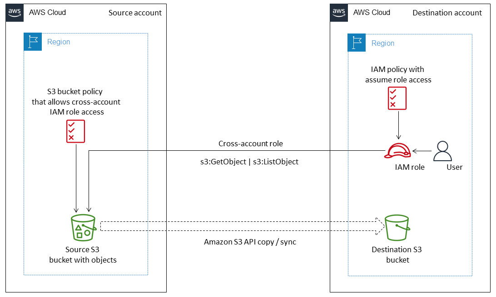

# onp.base.template

## Metadata
| attribute               | value                                         |
| ----------------------- | --------------------------------------------- |
| pattern-id              | onp.base.template                             |
| pattern-name            | Copy data from an S3 bucket to another account and Region by using the AWS CLI                                 |
| pattern-version         | 1.0.0                                         |
| pattern-description     | The pattern uses a source account and a destination account in different Regions. You attach a bucket policy to your source S3 bucket that grants the destination account access through AWS Identity and Access Management (IAM). You then create an IAM policy in your destination account that allows a user to perform PutObject and GetObject actions on the source S3 bucket. Finally, you run copy and sync commands to transfer data from the source S3 bucket to the destination S3 bucket.                         |
| organisation-id         | aws                                            |
| pattern-categories      | bootstrap                                     |

## What is this pattern?
This pattern is a basic template, modify it as you see fit

## What are the use cases?
This pattern is a basic template, modify it as you see fit

## Variables

| Variable               | Source                                         | Value |
| -----------------------| --------------------------------------------- | ------|
| Var1                   | SSM Parameter | onp/bootstrap/base-template|